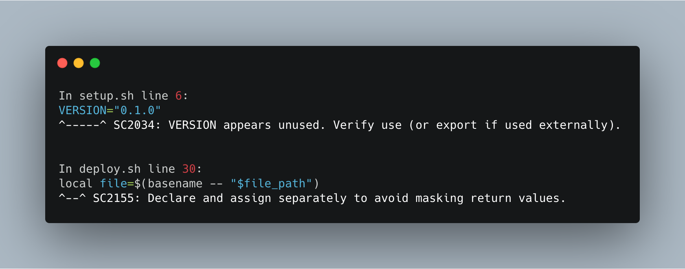

# Shell Linter

[](https://github.com/azohra/shell-linter/releases)
[](https://github.com/marketplace/actions/shell-linter)
[](https://github.com/azohra/shell-linter/actions?query=branch%3Adevelop)


A GitHub Action that performs static analysis for shell scripts using [ShellCheck](https://github.com/koalaman/shellcheck).



<br>

# Usage

Shell Linter can perform static analysis in various ways. By default it scans all the ShellCheck-supported shell scripts (sh/bash/dash/ksh) in your project. However, you can use the `path` parameter to scan a specific file or folder or use the `exclude-paths` parameter to exclude files or folders from the scan. With Shell Linter, you can also specify the minimum severity of errors to consider using the `severity` parameter. Specific use cases along with examples are shown below:

#### Run static analysis for all the supported shell scripts in your repository:
```yml
jobs:
  lint:
    runs-on: ubuntu-latest
    steps:
      - name: Checkout code
        uses: actions/checkout@v1
      - name: Run ShellCheck
        uses: azohra/shell-linter@latest
```

#### Run static analysis for a single shell script:
```yml
      - name: Run ShellCheck
        uses: azohra/shell-linter@latest
        with:
          path: "setup.sh"
```

#### Run static analysis for multiple shell scripts **with or without** extension:
```yml
      - name: Run ShellCheck
        uses: azohra/shell-linter@latest
        with:
          path: "setup,deploy.sh"
```

#### Run static analysis for all the shell scripts in a folder:
```yml
      - name: Run ShellCheck
        uses: azohra/shell-linter@latest
        with:
          path: "src"
```

#### Run static analysis using a **wildcard** path:
```yml
      - name: Run ShellCheck
        uses: azohra/shell-linter@latest
        with:
          path: "src/*.sh"
```
#### Exclude files and folders from the static analysis:
```yml
      - name: Run ShellCheck
        uses: azohra/shell-linter@latest
        with:
          exclude-paths: "src/setup.sh,tests/unit_tests" 
```
Note that `exclude-paths` only accepts paths relative to your project's root directory. However, **do not** include `./` at the beginning of the paths. 

To exclude a folder and it's content recursively just provide the path of the folder **without** a `/` at the end. In the example above, the entire folder at the path `tests/unit_tests` will be excluded from linting.

#### Run static analysis for all the shell scripts and only report issue with error severity:
```yml
      - name: Run ShellCheck
        uses: azohra/shell-linter@latest
        with:
          path: "src/*.sh"
          severity: "error"
```
#### Run analysis by using a specific version of Shell Linter:
```yml
      - name: Run ShellCheck
        uses: azohra/shell-linter@v0.6.0
```

# Input

### `path`
Optional. Execute lint check on a specific file or folder. Default: `.`

### `exclude-paths`
Optional. Exclude files and folders from ShellCheck scan. 

### `severity`
Optional. Specify minimum severity of errors to consider [style, info, warning, error]. Default: `style`

# License
This software is available as open source under the terms of the MIT License.
